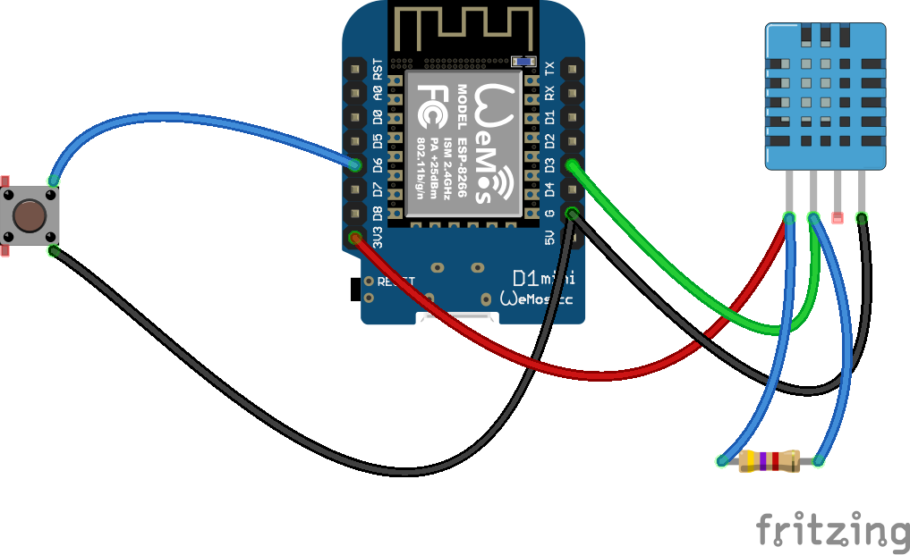

# ESP8266 IR Remote Controller

An ESP8266-based infrared remote controller with MQTT integration, designed for controlling air conditioning units (Lennox/MIDEA) with temperature and humidity monitoring capabilities.

## Overview

This project implements a smart IR remote controller using the ESP8266 microcontroller. It combines IR transmission/reception with MQTT connectivity to enable remote control of air conditioning units while monitoring environmental conditions through a DHT11 sensor. The system uses finite state machines for non-blocking operation and reliable MQTT reconnection handling.

## Key Features

### Core Functionality
- **IR Remote Control**: Send and receive infrared signals for AC control (MIDEA/Lennox format)
- **MQTT Integration**: Full MQTT client with publish/subscribe capabilities
- **WiFi Configuration**: Built-in WiFi Manager for easy network setup via captive portal
- **Environmental Monitoring**: Non-blocking DHT11 temperature and humidity sensor reading
- **Physical Button Control**: Hardware button support with debouncing logic
- **Persistent Configuration**: SPIFFS-based storage for WiFi and MQTT settings

### Advanced Features
- **Dual FSM Architecture**: 
  - MQTT connection state machine with automatic reconnection (10-second retry interval)
  - Air conditioner control state machine for multi-step IR command sequences
- **Non-blocking Design**: All sensor readings and state transitions are non-blocking
- **FBD (Function Block Diagram) Components**: 
  - TON (Timer On Delay) for button debouncing
  - Rising/Falling edge triggers for button events
- **OTA Update Support**: Over-the-air firmware updates via ESP8266httpUpdate
- **Configuration Reset**: Hardware reset button to clear settings and enter AP mode

## Hardware Requirements

### Components
- ESP8266 development board (NodeMCU, Wemos D1 Mini, etc.)
- IR LED (for transmission)
- IR Receiver (38kHz, for reception)
- DHT11 Temperature & Humidity Sensor
- Push buttons (trigger and reset)
- Appropriate resistors and wiring

### Pin Configuration
| Pin | GPIO | Function |
|-----|------|----------|
| D2  | 4    | IR Transmitter |
| D3  | 0    | DHT11 Sensor |
| D4  | 2    | LED Indicator |
| D6  | 12   | Reset Button |
| D7  | 13   | IR Receiver |
| D8  | 15   | Trigger Button |

### Wiring Diagram

The wiring diagram above shows the complete circuit connections for the ESP8266 IR Remote Controller. Key connections include:

- **IR Transmitter (D2/GPIO4)**: Connect an IR LED with appropriate current-limiting resistor (typically 100-330Ω). For better range, consider using a transistor driver circuit.
- **IR Receiver (D7/GPIO13)**: Connect a 38kHz IR receiver module (e.g., TSOP38238) with VCC to 3.3V, GND to ground, and OUT to D7.
- **DHT11 Sensor (D3/GPIO0)**: Connect DHT11 with VCC to 3.3V, GND to ground, and DATA to D3. A 10kΩ pull-up resistor between DATA and VCC is recommended.
- **Trigger Button (D8/GPIO15)**: Connect push button between D8 and ground (INPUT_PULLUP mode is used).
- **Reset Button (D6/GPIO12)**: Connect push button between D6 and ground for configuration reset.
- **LED Indicator (D4/GPIO2)**: Built-in LED on most ESP8266 boards, or connect external LED with resistor.

**Note**: The Fritzing source file (`wiring.fzz`) is included in the repository for modifications.

## Software Dependencies

### Required Libraries
- **ESP8266WiFi**: WiFi connectivity
- **IRremoteESP8266**: IR transmission and reception
- **PubSubClient**: MQTT client
- **WiFiManager**: WiFi configuration portal
- **ArduinoJson**: JSON parsing and serialization
- **ESP8266WebServer**: Web server for configuration
- **DNSServer**: Captive portal DNS
- **ESP8266httpUpdate**: OTA firmware updates

### Custom Modules
- `FiniteStateMachine`: FSM implementation for state management
- `FBD`: Function block diagram components (TON, TOF, TP timers, edge triggers)
- `dht_nonblocking`: Non-blocking DHT11 sensor library

## Configuration

### Initial Setup
1. **First Boot**: On first boot or when reset button is pressed, the device creates a WiFi access point
   - SSID: `LENNOX-00XXXXXX` (where XXXXXX is the chip ID)
   - Password: `lennox2018`

2. **Configuration Portal**: Connect to the AP and configure:
   - WiFi SSID and Password
   - MQTT Server Address
   - MQTT Server Port (default: 1883)
   - MQTT Username and Password
   - Device Topic/ID
   - Data Publishing Interval (seconds)

3. **Reset Configuration**: Hold the reset button (D6) during boot to clear settings

### MQTT Topics

The device uses the following topic structure based on the configured device ID:

#### Published Topics
- `{device_id}/pub/temp` - Temperature readings (Fahrenheit)
- `{device_id}/pub/humi` - Humidity readings (percentage)
- `{device_id}/pub/button` - Button state ("on"/"off")
- `{device_id}/status` - Device status (will message)
- `{device_id}/notify` - Event notifications

#### Subscribed Topics
- `{device_id}/sub/IR` - IR command input (hex format)

## Operation

### State Machine Behavior

**MQTT State Machine**:
- Monitors MQTT connection continuously
- Automatically attempts reconnection every 10 seconds if disconnected
- Handles message callbacks and publishes sensor data

**Air Conditioner Control FSM**:
- **Idle**: Waiting for trigger
- **Step 1**: Sends first IR command, waits 5 seconds
- **Step 2**: Sends second IR command, waits 5 seconds, returns to idle
- Prevents command overlap during active sequences

### Button Operation
- **Press**: Triggers IR sequence if in idle state, publishes button press event
- **Release**: Publishes button release event
- Debounced with 200ms TON timer

### Sensor Data Publishing
- Temperature and humidity data published at configured intervals
- Non-blocking measurement prevents system delays
- Automatic error handling for sensor failures

## Building and Uploading

### Arduino IDE Setup
1. Install ESP8266 board support
2. Install required libraries via Library Manager
3. Select appropriate board (e.g., NodeMCU 1.0)
4. Set upload speed to 115200
5. Upload sketch

### Development
- Version: 0.10
- Debug output available via Serial (115200 baud)
- Prefix for debug messages: `** Lennox :`

## Architecture Highlights

### Non-blocking Design
All operations use non-blocking patterns:
- DHT11 readings use state-based polling
- FSM updates prevent blocking delays
- MQTT loop runs continuously
- Button debouncing via edge detection

### Modular Structure
- `globals.h/cpp`: Global variables, pin definitions, and utility functions
- `FiniteStateMachine.h/cpp`: Generic FSM implementation
- `FBD.h/cpp`: IEC 61131-3 inspired function blocks
- `dht_nonblocking.h/cpp`: Custom non-blocking DHT sensor library

## Troubleshooting

- **Can't connect to WiFi**: Press reset button during boot to reconfigure
- **MQTT not connecting**: Check server address, port, and credentials
- **No IR transmission**: Verify IR LED connection and polarity
- **DHT11 errors**: Check sensor wiring and 5-second startup delay

## License

This project is open-source. Please refer to individual library licenses for dependencies.

## Version History

- **v0.10**: Current version with dual FSM architecture, MQTT integration, and DHT11 support
